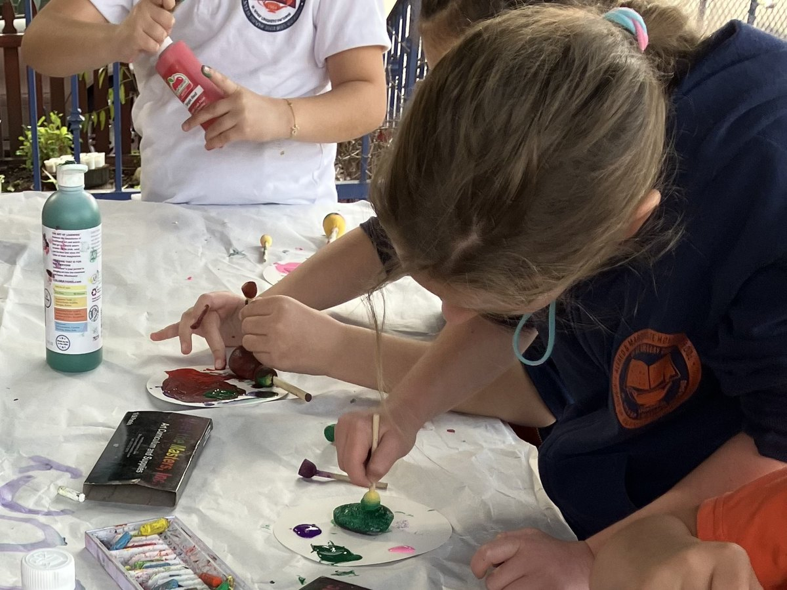

# Pasadena Country Garden School — website (V3)

Static, multi-page site. No build step, no dependencies. Open `index.html` or drop the
folder on any host (GitHub Pages, Netlify, Cloudflare Pages) and it works.

```
index.html          Home
about.html          About / Who We Are
programs.html       Our Approach & Programs
food.html           Food
gallery.html        Gallery
registration.html   Enrollment / Registration
contact.html        Contact
licensing.html      Licensing & Compliance   (linked in every footer)
assets/css/styles.css
assets/js/main.js
assets/img/…               logo assets (see below)
```

## Logo assets

All derived from the client's original `PCGS Logo.jpg`, with the cream field
keyed out to transparency so the emblem sits on any background.

| File | Used for |
|---|---|
| `logo-mark.png` | The emblem (hand + seedling on the sage disc). Header and footer, paired with the school name as live text. |
| `logo-full.png` | The complete lockup incl. the original wordmark. Transparent — use anywhere the whole logo belongs. |
| `favicon-32.png`, `favicon-180.png` | Browser tab and iOS home screen. |
| `og-card.jpg` | 1200×630 social share card (Facebook/iMessage previews). |
| `pcgs-logo.jpg` | The untouched original. Keep it — everything else is regenerated from it. |

**Why the emblem plus text, rather than the whole lockup?** The original stacks
the mark above the wordmark, so at header height (~46px) "GARDEN SCHOOL" would
render around 4px tall and unreadable. The emblem sits beside the name as live
text instead — legible, selectable, and searchable. If you'd rather see the
original wordmark in the header, swap in `logo-full.png` and drop the
`.logo__text` span; the header will just need to grow to roughly 90px.

---

## 1. Adding the real photos

**Placed so far** (both cropped and compressed from the originals in this folder):

| Web file | From | Where |
|---|---|---|
| `hero-lots-of-heads.jpg` | `021 AP Lots of Heads.jpeg` | Home hero, shown whole (uncropped) |
| `children-painting.jpg` | `006 AP Older Children Intently Painting.png` | Home, "A holistic approach" |

Every remaining slot is a placeholder box reading `[IMAGE: …]`. Replace the whole
`<div class="ph …">…</div>` with an `` — same rounding and
shadow, so nothing else changes:

```html
<!-- before -->
<div class="ph ph--4x3">[IMAGE: Children at work — craft table or garden beds]</div>

<!-- after -->

```

Always keep `width`/`height` — they reserve the space so the page doesn't jump
as photos load.

**The originals are not web-ready.** This folder is ~326 MB: many are phone
photos saved as PNG at 13–16 MB each (`040 AP Child Pruning.png` is 14 MB). A
PNG of a photograph is roughly 45× larger than the equivalent JPEG for no
visible gain. Nothing unreferenced is served, but before launch the originals
should move out of the deploy folder and only the cropped JPEGs ship.

Watch for **EXIF rotation**: several files (incl. `021 Lots of Heads`) are stored
sideways with a rotation flag. `tools/make-logo-assets.py` shows the fix —
`ImageOps.exif_transpose()` bakes the rotation into the pixels.

- **Hero** (`index.html`): use the widest, brightest photo you have — 2000px+ across.
  Drop the `loading="lazy"` on this one only; it should load immediately.
- **Alt text is required.** Describe what's happening, not "photo of kids."
- **Gallery**: swap the `.ph` inside each `<button>`, leave the button and its
  `data-caption` alone — the lightbox reads whatever is inside.

## 2. Editing the announcement bar

Top of every page, marked `EDIT ME`. Change the text; that's it. Dismissal is
remembered per message, so when you change the wording every parent sees the new
one again. Put the Open House date here when you have it.

The mint strip under the header is separate — the "Now enrolling for 2026–27" line.

## 3. Before you publish — confirm these

The build follows the brief; these are the items the brief itself flagged.
Search the files for `[CONFIRM]`, `[ATTACH]`, `[REVIEW]`, and `[DATE]`.

| Where | What's needed |
|---|---|
| `licensing.html` | **Current licensed capacity** |
| `licensing.html`, footer (all pages) | **Pasadena Business No.** |
| `licensing.html` | Which licensing documents to post under Aryanna's Law — put PDFs in `assets/docs/` and link them |
| `licensing.html` | Whether any Notices of Conference / Accusations / Notices of Intent to Revoke exist. **If none exist the page must say so explicitly** — draft wording is already in place |
| `licensing.html` | Current CCLD regional office phone + address |
| `licensing.html` | "Last reviewed" date |
| `programs.html` | Faith-based affiliation specifics, if any (section is commented out pending your wording) |
| `index.html` | Three real parent reviews — placeholders marked `[REVIEW]` |
| footer (all pages) | Real Instagram / Facebook / Yelp URLs (currently `#`) |

**The licensing page is drafted from the brief and is not legal advice.** Have the
client or their attorney confirm the required disclosures before launch.

## 4. How families get in touch

**There is deliberately no contact form.** The phone is the channel — Alexandra
answers her own, and the site says so in several places. An earlier draft had a
form that handed off via `mailto:`, but it pointed at an inbox that isn't watched
for enquiries: a parent could send a tour request that nobody ever read. A form
that silently loses leads is worse than no form.

The Contact page is the Visit details (address, phone, email, hours), a map, and
a click-to-call button. Every page also carries a sticky **Call / Enroll now**
bar on mobile, and applications go straight to Brightwheel.

If a form is ever wanted, connect it to a service that emails *and* stores
submissions (Formspree, Netlify Forms, Basin) — never `mailto:` — and only if
someone has agreed to monitor it.

## 5. SEO / launch checklist

- [ ] Point the domain and update the `<link rel="canonical">` + JSON-LD `url` on
      each page if the final domain differs from `pasadenacountrygardenschool.com`.
- [ ] **Redirect the old Google Sites URLs** to preserve ranking:
      Home → `/`, About → `/about.html`, Programs → `/programs.html`,
      Food → `/food.html`, Registration → `/registration.html`, Contact → `/contact.html`
- [ ] **Set up a Google Business Profile** — they have none. Biggest single SEO win available.
- [ ] Submit a sitemap to Google Search Console.
- [ ] License No. 198021952 is already on the home page, in every footer, and in the JSON-LD.

## 6. Design notes

- **Palette**: garden green `#2f6b3f` (brand), periwinkle `#5b6fd6` (primary CTAs),
  mint `#e4f3ea` (enrolling strip), sun `#f2b441` + coral `#e8735a` (accents).
- **Type**: Fredoka (display) + Nunito (body), via Google Fonts.
- **Signature**: the scalloped "garden row" divider with falling seeds between
  sections. Set its two colors per instance:
  `style="--row-over: <color of section above>; --row-under: <color of section below>"`.
- All tokens live at the top of `styles.css`. Change a color once there.

**Accessibility floor this build holds to** — keep it if you edit:
scroll reveals are gated on a `js` class so content never depends on JavaScript
running; `prefers-reduced-motion` is respected; every page is free of horizontal
scroll from 360px up; focus is visible; the gallery lightbox closes on Escape.
